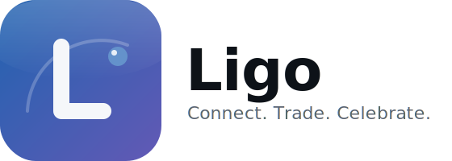
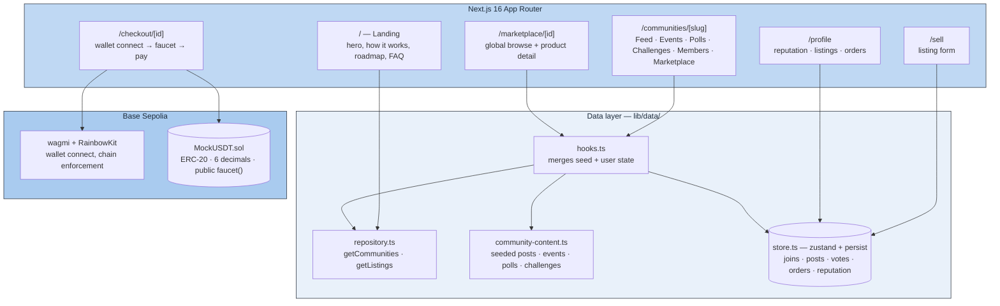
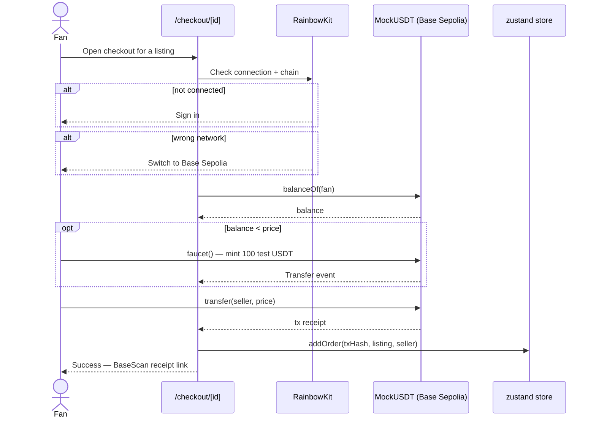
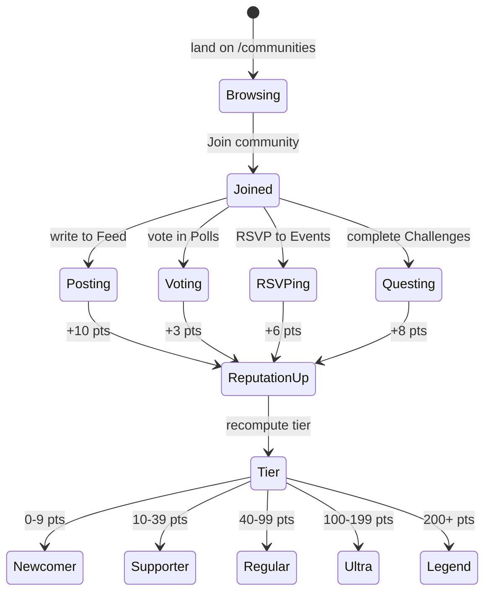
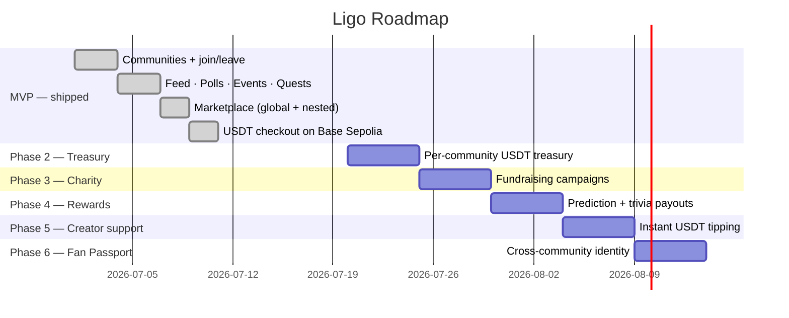

<p align="center">
  
</p>

# Ligo — Connect. Trade. Celebrate.

**The community is the product. Commerce, payments, and blockchain are just how it moves.**

Ligo is a **community-first** global fan platform. Fans join a community (a national team or club) to connect, post, vote, RSVP to watch parties, and complete challenges — then trade merchandise and support each other with borderless USDT. Football first; crypto stays in the background so it feels like Discord + Reddit + a marketplace, not a DeFi app.

> Sponsor / chain capability: **USDT on Base Sepolia** (EVM). See [`submission/DORAHACKS.md`](submission/DORAHACKS.md) for the full write-up.


📖 Product philosophy: [`AGENTS.md`](AGENTS.md) · Brand system: [`brand.md`](brand.md) · DoraHacks submission: [`submission/DORAHACKS.md`](submission/DORAHACKS.md)

---

## Table of contents

- [Why community-first](#why-community-first)
- [How it works](#how-it-works)
- [Architecture](#architecture)
- [Checkout flow (on-chain payment)](#checkout-flow-on-chain-payment)
- [Community engagement states](#community-engagement-states)
- [Tech stack](#tech-stack)
- [Quickstart](#quickstart)
- [Deploying MockUSDT](#deploying-mockusdt-base-sepolia)
- [Environment variables](#environment-variables)
- [Project structure](#project-structure)
- [Roadmap](#roadmap)
- [Disclaimer](#disclaimer)

---

## Why community-first

Most "fan x crypto" products lead with the wallet. Ligo leads with the **community**:

```
Community First → Commerce Second → Payments Third → Blockchain Last
```

Every feature has to answer: *does this strengthen the community?* If not, it gets cut. The marketplace, treasury, charity, and rewards are all **features that live inside a community** — never the entry point. See [`AGENTS.md`](AGENTS.md) for the full product philosophy this build follows.

## How it works

1. **Join** a community — Indonesia Fans, Brazil Fans, Argentina Fans, Manchester United, FC Barcelona, Japan Fans.
2. **Participate** — post to the feed, vote in polls (Man of the Match, predictions), RSVP to watch parties, complete challenges. Every action builds reputation.
3. **Trade** — buy or sell jerseys, scarves, signed items, tickets, and stickers, either globally or inside your community's own marketplace tab.
4. **Pay** — connect a wallet, mint free test USDT from the in-app faucet, and settle the purchase directly to the seller on Base Sepolia — with an on-chain receipt.

## Architecture



The **repository seam** (`lib/data/repository.ts`) is deliberate: pages never touch seed data or the store directly. Swapping in Supabase later means rewriting this one file — every page, hook, and component stays untouched.

## Checkout flow (on-chain payment)



## Community engagement states



## Tech stack

### Frontend
| Technology | Purpose |
|---|---|
| Next.js 16 (App Router, Turbopack) | Framework |
| React 19 · TypeScript 5 | UI + types |
| Tailwind CSS v4 · shadcn/ui | Styling + components |
| next-themes | Light/dark mode |
| Manrope + JetBrains Mono | Brand typography — see [`brand.md`](brand.md) |

### Web3
| Technology | Purpose |
|---|---|
| wagmi 2 + viem 2 | Wallet + contract reads/writes |
| RainbowKit 2 | Wallet connect UI, themed to the brand |
| @tanstack/react-query | Async state for on-chain reads |
| Base Sepolia | Target testnet |

### Contracts
| Technology | Purpose |
|---|---|
| Foundry (forge/cast/anvil) | Build, test, deploy |
| Solidity ^0.8.20 | `MockUSDT.sol` — 6-decimal ERC-20 + public `faucet()` |

### State & data
| Technology | Purpose |
|---|---|
| zustand + persist | Client store — joins, posts, votes, RSVPs, orders, reputation |
| Seed data (`lib/data/seed.ts`, `community-content.ts`) | Communities, listings, feed posts, events, polls, challenges |

## Quickstart

```bash
npm install
npm run dev              # → http://localhost:3000
```

Works out of the box with seed data — no env vars required to browse communities, the feed, polls, challenges, or the marketplace. Payments need two vars in `.env.local`:

```bash
# Free at https://cloud.reown.com — enables WalletConnect QR pairing.
# Injected wallets (MetaMask, Rabby) work without it.
NEXT_PUBLIC_WALLETCONNECT_PROJECT_ID=

# Deployed MockUSDT address on Base Sepolia — see below.
NEXT_PUBLIC_USDT_ADDRESS=
```

## Deploying MockUSDT (Base Sepolia)

```bash
cd contracts
forge test                # 9 tests — transfer, faucet, allowance, edge cases

forge script script/Deploy.s.sol \
  --rpc-url https://sepolia.base.org \
  --private-key <THROWAWAY_DEPLOYER_KEY> \
  --broadcast
```

Copy the printed `MockUSDT deployed at:` address into `NEXT_PUBLIC_USDT_ADDRESS` and restart the dev server. Fund the deployer key first from a Base Sepolia faucet (e.g. [Alchemy](https://www.alchemy.com/faucets/base-sepolia) or [Coinbase](https://portal.cdp.coinbase.com/products/faucet)).

> **Fallback without deploying:** Circle's testnet USDC on Base Sepolia (`0x036CbD53842c5426634e7929541eC2318f3dCF7e`, fund at faucet.circle.com) works with the same env var — but the in-app "Get test USDT" faucet button won't (no `faucet()` on real USDC).

## Environment variables

| Variable | Required | Purpose |
|---|---|---|
| `NEXT_PUBLIC_WALLETCONNECT_PROJECT_ID` | ⬜ | WalletConnect QR pairing (Reown Cloud, free) |
| `NEXT_PUBLIC_USDT_ADDRESS` | ⬜ | Deployed `MockUSDT` address — checkout shows a graceful notice without it |

## Project structure

```
ligo/
├── app/
│   ├── page.tsx                    # Landing — hero, how it works, roadmap, FAQ
│   ├── communities/
│   │   ├── page.tsx                # Browse + search + filter
│   │   └── [slug]/page.tsx         # Tabbed hub: Feed·Events·Polls·Challenges·Members·Marketplace
│   ├── marketplace/
│   │   ├── page.tsx                # Global browse + filters
│   │   └── [id]/page.tsx           # Product detail
│   ├── sell/page.tsx               # List an item
│   ├── checkout/[id]/page.tsx      # Wallet connect → faucet → pay → receipt
│   ├── profile/page.tsx            # Reputation, listings, orders
│   └── settings/page.tsx           # Display name, theme
├── components/
│   ├── community/                  # feed-tab, events-tab, polls-tab, challenges-tab, members-tab, marketplace-tab
│   └── ui/                         # shadcn primitives
├── lib/
│   ├── data/
│   │   ├── seed.ts                 # Communities + marketplace listings
│   │   ├── community-content.ts    # Seeded feed posts, events, polls, challenges
│   │   ├── repository.ts           # Read seam — swap for Supabase later without touching pages
│   │   └── hooks.ts                # Merges seed + user-created state
│   ├── store.ts                    # zustand + persist — engagement, orders, derived reputation
│   ├── wagmi.ts / usdt.ts          # Chain config + contract ABI/address
│   └── types.ts
├── contracts/                      # Foundry project
│   ├── src/MockUSDT.sol
│   ├── test/MockUSDT.t.sol         # 9 passing tests
│   └── script/Deploy.s.sol
├── brand.md                        # Palette (Club Sapphire), typography, voice — source of truth
├── AGENTS.md                       # Product philosophy: community-first architecture
└── submission/DORAHACKS.md         # Hackathon submission write-up
```

## Roadmap



## Disclaimer

Ligo's MVP runs entirely on **Base Sepolia testnet**. All USDT is minted from an in-app faucet — no real funds move, and no financial advice is implied by any feature. Community joins, feed posts, votes, RSVPs, and reputation are stored locally in the browser for this demo build.

---

**Community First. Commerce Second. Payments Third. Blockchain Last.**
